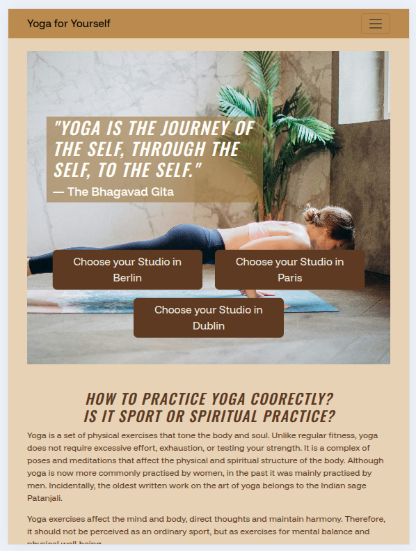
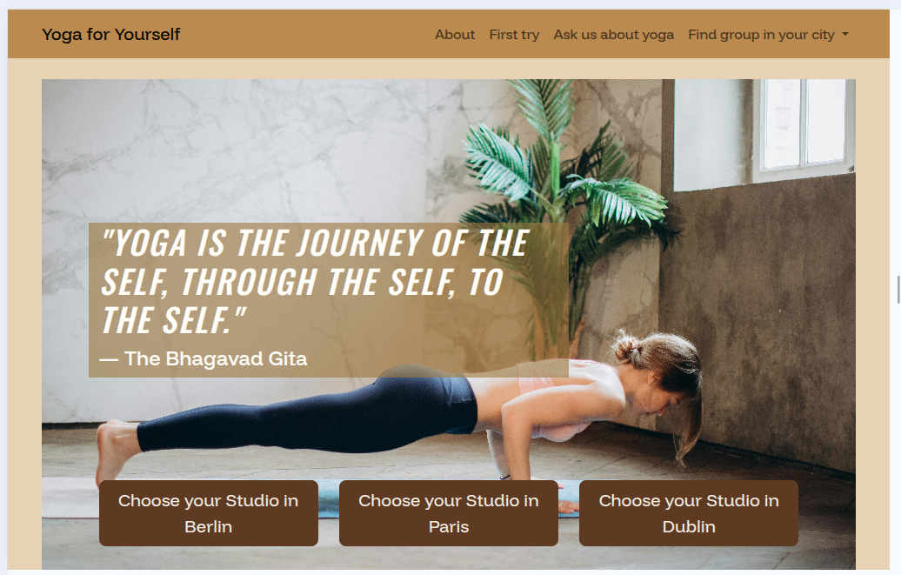

# 🧘 Yoga Website

This is a website for people who are just starting to get into yoga or are looking for a community in **Paris, Dublin, or Berlin** to practise yoga in a group. You can get more info about yoga in these cities or about the practice in general by asking the website. The website features an article about yoga practice for beginners, combining it with meditation, nutrition, general information about yoga classes, and yoga for pregnant women. Accordingly, the target audience is mostly women who would like to try it..

Source: [Techsini Multi Device Website Mockup Generator](http://techsini.com/multi-mockup/?url=https://apeskinian.github.io/p1_bgfc/)

## 🌐 Live Demo
[Visit the website](https://katerynakulik.github.io/yoga/)

---

## 📋 Built With
- HTML5
- CSS3
- [Bootstrap 5](https://getbootstrap.com/) – used for responsive layout, grid system, and components.

---

## UX

The strategy was to create a simple, visually calming, and easy-to-navigate website that introduces beginners to yoga through a combination of informative text, images, and beginner-friendly videos.

The scope of features I wanted to include were:

An introductory article explaining what yoga is and how it is practiced (targeted at new practitioners).

Illustrative images of yoga poses embedded in the article to help users visually understand the practice.

Four beginner-oriented videos from different bloggers, each with a unique style and duration (10, 15, and 30 minutes), accompanied by short descriptions of the poses performed.

A clear navigation structure allowing visitors to easily find the introduction and video content on any device.

When designing the site structure, I decided to place the yoga introduction and pose images on the homepage so that visitors could get a complete overview in one place. The beginner videos were placed in a separate section to give users flexibility in choosing the type and length of their session.

The layout is fully responsive, ensuring that text remains easy to read and media elements display without distortion on all screen sizes. The color palette and typography were chosen to create a calm, focused browsing experience that reflects the relaxing nature of yoga practice.

### Colour Scheme

#F5F0E6 — used for button text.
#5C3B1E — used for website text.
#E6D3B3 — used as the website background.
#B88B4A — used as the background for buttons.
#FFFDF7 — used for main heading text.

I used [Colormind](http://colormind.io/) to generate my colour palette from the hero image.

### Typography

[Funnel Display](https://fonts.google.com/specimen/Funnel+Display) was used for the website.

[Oswald](https://fonts.google.com/specimen/Oswald) was used for the headings.

### User Stories

## New Site Users

- As a user, I know a little about yoga but want to try exercises on my own, because I feel shy and fear I might do them wrong.
- As a user, I want to see a section about yoga with examples of poses, so I can understand what yoga is and what exercises I can do.
- As a visitor, I want to see a welcoming section that quickly introduces the website, so I immediately understand its purpose.
- As a user moving to a new city, I want to see the top 3 yoga studios in the city so that I can quickly find a place to practice.
- As a user, I want to conveniently search for information about what yoga is, find yoga in my city if it exists on the site, or ask an additional question, so that I can quickly get the information I need.
- As an experienced yoga practitioner moving to Dublin, I want to find local communities or support groups so I can integrate into the local yoga scene.

## Returning Site Users

- As a user, I want to conveniently search for information about what yoga is, find yoga in my city if it exists on the site, or ask an additional question, so that I can quickly get the information I need.
- As a user, I want the “Success” page to display links to existing city pages and show relevant advertiser banners based on keywords from users’ questions, so that users can continue exploring the site and advertisers get exposure in contextually relevant locations.

## Business Goals

- As a business owner, I want to display advertisements from content creators and offline yoga studios on my website, so that I can generate additional revenue and promote relevant partners to my users.
- As a business owner, I want to collect information to improve website traffic.
- As the business owner, I want customers to remain on my page even if they enter the address incorrectly, and be able to return to the home page with one click.
- As a business owner, I want users who submit the contact form to be redirected to a “Thank You” page so that they know their message was sent and can easily return to the homepage.

## Features

### Navbar & City Dropdown

The navbar is fixed to the top of the page, ensuring it is always visible as users scroll. On larger screens, it expands to show all menu items, while on smaller devices it collapses into a toggleable hamburger menu. The menu items include About, First Try, Ask us about yoga, and a dropdown for finding a yoga group in your city. The dropdown lists Dublin, Paris, and Berlin, allowing users to quickly navigate to city-specific pages. The navbar’s background color matches the site’s palette, maintaining visual consistency.

| Type  | Appearance |
|---------|------------|
| Mobile / Tablet |  |
| Mobile / Tablet |  |
| Mobile / Tablet |  |
| Desktop |  |
| Desktop |  |

### Hero Section & Call to Action
The hero section greets visitors with an inspiring quote from The Bhagavad Gita, placed prominently in large italic text to set the tone of the site. The text is aligned to the left within a wide column, ensuring readability while leaving space for the clean, minimalist layout. Below the quote, the call-to-action area invites users to choose their preferred yoga studio location. Three large, full-width buttons — styled with a secondary color and responsive sizing — direct visitors to city-specific pages for Berlin, Paris, and Dublin. On larger screens, these buttons align neatly in a row, while on smaller devices they stack vertically for optimal accessibility. The combination of an inspirational message and immediate navigation options creates both an emotional connection and a clear path forward for the user.
| Device  | Appearance |
|---------|------------|
| Mobile  |   |
| Tablet  | |
| Desktop |  |

### About section or How to practice Yoga coorectly?
The "About" section provides a comprehensive overview of yoga, covering various aspects of the practice. It clarifies whether yoga is a sport or a spiritual practice, highlighting its benefits for both physical and mental well-being. The section offers advice for beginners, such as finding an instructor and the importance of breathwork. It also includes recommendations for pregnant women and discusses the influence of yoga on nutrition and daily life. Quotes from instructor Iryna Vizlou add a personal and expert perspective.

| Device  | Appearance |
|---------|------------|
| Mobile  |       |
| Tablet  |      |
| Desktop |    |

### Take Your Inspiration

A selection of beginner-friendly yoga videos, embedded from YouTube in a responsive card layout:

| Video	| Description |
| 30-Minute Yoga For Beginners | Full-body yoga session for beginners, 30 minutes.|
| Gentle Yoga for Flexibility & Stress Reduction | Relaxing yoga flow to improve flexibility and reduce stress. |
| Gentle Full Body Yoga Flow | Easy full-body yoga session suitable for beginners. |
| Morning Yoga For Beginners | Short morning yoga routine to start your day energized.|

| Device  | Appearance |
|---------|------------|
| Mobile  |   |
| Tablet  | |
| Desktop |  |

### Contact Us

This section provides a contact form for users who want to learn more about yoga in their city. The form is designed with a responsive layout and includes the following fields:
- Your name – required text input.
- Email – required email input.
- Your question – optional textarea for additional inquiries.
- Choose your city – required selection via radio buttons (Dublin, Berlin, Paris).

The form submits data to a success page (success.html) and is styled with Bootstrap for a clean and mobile-friendly appearance.

| Device  | Appearance |
|---------|------------|
| Mobile  |   |
| Tablet  | |
| Desktop |  |

## Credits
- **Background image** by [Elina Fairytale](https://www.pexels.com/@elly-fairytale/) from [Pexels](https://www.pexels.com/photo/3823063/), used under the [Pexels License](https://www.pexels.com/license/).
- **Yoga icon** from [Flaticon](https://www.flaticon.com/free-icon/yoga_3456459).
- **Framework**: This website was built primarily using [Bootstrap](https://getbootstrap.com/).
- **Article** in the block **About** by [Iryna Vizlou](https://www.vezha.org/sport-chy-duhovna-praktyka-shho-take-joga-i-yak-pravylno-neyu-zajmatys/) in Ukrainian translated with [Deepl](https://www.deepl.com/en/translator)
- In **About block** images:
- by [Elina Fairytale](https://www.pexels.com/@elly-fairytale/) from [Pexels](https://www.pexels.com/photo/3823075/), used under the [Pexels License](https://www.pexels.com/license/).
- by [Elina Fairytale](https://www.pexels.com/@elly-fairytale/) from [Pexels](https://www.pexels.com/photo/4534689/), used under the [Pexels License](https://www.pexels.com/license/).
- by [Elina Fairytale](https://www.pexels.com/@elly-fairytale/) from [Pexels](https://www.pexels.com/photo/3823043/), used under the [Pexels License](https://www.pexels.com/license/).
- **In section Take your inspiration:
- video by [Yoga with Adriene](https://www.youtube.com/@yogawithadriene) from [Youtube](https://www.youtube.com/watch?v=AB3Y-4a3ZrU&t=6s&ab_channel=YogaWithAdriene)
- video by [Yoga with Kassandra](https://www.youtube.com/@yogawithkassandra) from [Youtube](https://www.youtube.com/watch?v=EvMTrP8eRvM&t=3s&ab_channel=YogawithKassandra)
- video by [Charlie Follows](https://www.youtube.com/@CharlieFollows) from [Youtube](https://www.youtube.com/watch?v=QcsvuCQd53k&t=2s&ab_channel=CharlieFollows)
- video by [Yoga With Bird](https://www.youtube.com/@YogaWithBird) from [Youtube](https://www.youtube.com/watch?v=wRAtVLgj-wU&t=2s&ab_channel=YogaWithBird)