# üßò Yoga Website

This is a website for people who are just starting to get into yoga or are looking for a community in **Paris, Dublin, or Berlin** to practise yoga in a group. You can get more info about yoga in these cities or about the practice in general by asking the website. The website features an article about yoga practice for beginners, combining it with meditation, nutrition, general information about yoga classes, and yoga for pregnant women. Accordingly, the target audience is mostly women who would like to try it.


Source: [Techsini Multi Device Website Mockup Generator](http://techsini.com/multi-mockup/?url=https://apeskinian.github.io/p1_bgfc/)

## üåê Live Demo

[Visit the website](https://katerynakulik.github.io/yoga/)

---

## üìã Built With

- HTML5
- CSS3
- [Bootstrap 5](https://getbootstrap.com/) – used for responsive layout, grid system, and components.

---

## UX

The strategy was to create a simple, visually calming, and easy-to-navigate website that introduces beginners to yoga through a combination of informative text, images, and beginner-friendly videos.

The scope of features I wanted to include were:

An introductory article explaining what yoga is and how it is practiced (targeted at new practitioners).

Illustrative images of yoga poses embedded in the article to help users visually understand the practice.

Four beginner-oriented videos from different bloggers, each with a unique style and duration (10, 15, and 30 minutes), accompanied by short descriptions of the poses performed.

A clear navigation structure allowing visitors to easily find the introduction and video content on any device.

When designing the site structure, I decided to place the yoga introduction and pose images on the homepage so that visitors could get a complete overview in one place. The beginner videos were placed in a separate section to give users flexibility in choosing the type and length of their session.

The layout is fully responsive, ensuring that text remains easy to read and media elements display without distortion on all screen sizes. The color palette and typography were chosen to create a calm, focused browsing experience that reflects the relaxing nature of yoga practice.

### Colour Scheme

#F5F0E6 — used for button text.
#5C3B1E — used for website text.
#E6D3B3 — used as the website background.
#B88B4A — used as the background for buttons.
#FFFDF7 — used for main heading text.

I used [Colormind](http://colormind.io/) to generate my colour palette from the hero image.


### Typography

[Funnel Display](https://fonts.google.com/specimen/Funnel+Display) was used for the headings.

[Oswald](https://fonts.google.com/specimen/Oswald) was used for the headings.

## User Stories

### New Site Users

- As a user, I know a little about yoga but want to try exercises on my own, because I prefer to practice at home first and build confidence.
- As a user, I want to see a section about yoga with examples of poses, so I can understand what yoga is and what exercises I can do.
- As a visitor, I want to see a welcoming section that quickly introduces the website, so I immediately understand its purpose.
- As a user moving to a new city, I want to see the top 3 yoga studios in the city to quickly find a place to practice.
- As a user, I want to conveniently search for information about what yoga is, find yoga in my city if it exists on the site, or ask an additional question, so that I can quickly get the information I need.
- As an experienced yoga practitioner moving to Dublin, I want to find local communities or support groups so I can integrate into the local yoga scene.

### Returning Site Users

- As a user, I want to conveniently search for information about what yoga is, find yoga in my city if it exists on the site, or ask an additional question, so that I can quickly get the information I need.
- As a user, I want the “Success” page to display links to existing city pages and show relevant advertiser banners based on keywords from users’ questions, so that users can continue exploring the site and advertisers get exposure in contextually relevant locations.

### Business Goals

- As a business owner, I want to display advertisements from content creators and offline yoga studios on my website, so that I can generate additional revenue and promote relevant partners to my users.
- As a business owner, I want to collect information to improve website traffic.
- As the business owner, I want customers to remain on my page even if they enter the address incorrectly, and be able to return to the home page with one click.
- As a business owner, I want users who submit the contact form to be redirected to a “Thank You” page so that they know their message was sent and can easily return to the homepage.

## Features

### Navbar & City Dropdown

Main navigation menu available on every page.

**Features:**

- Links to all main sections of the site (Home, About, Inspiration, Cities, Contact).
- Responsive design with a dropdown menu on smaller screens.
- Consistent position across all pages for easy access.

**Purpose:**  
Ensure smooth navigation throughout the website and help users quickly find the information they need.

| Type            | Appearance                                                               |
| --------------- | ------------------------------------------------------------------------ |
| Mobile / Tablet | 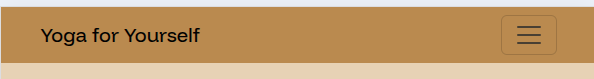                        |
| Mobile / Tablet | 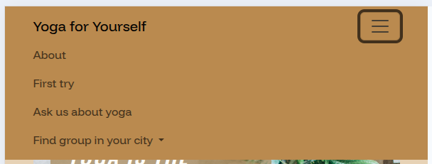       |
| Mobile / Tablet |       |
| Desktop         |                       |
| Desktop         |  |

### Hero Section & Call to Action

The hero section greets visitors with an inspiring quote from The Bhagavad Gita, placed prominently in large italic text to set the tone of the site. The text is aligned to the left within a wide column, ensuring readability while leaving space for the clean, minimalist layout. Below the quote, the call-to-action area invites users to choose their preferred yoga studio location. Three large, full-width buttons — styled with a secondary color and responsive sizing — direct visitors to city-specific pages for Berlin, Paris, and Dublin. On larger screens, these buttons align neatly in a row, while on smaller devices they stack vertically for optimal accessibility. The combination of an inspirational message and immediate navigation options creates both an emotional connection and a clear path forward for the user.

| Device  | Appearance                                                                                                                                |
| ------- | ----------------------------------------------------------------------------------------------------------------------------------------- |
| Mobile  |   |
| Tablet  |                                                                       |
| Desktop |                                                                        |

### About section or How to practice Yoga correctly?

This section introduces users to yoga, its benefits, and basic poses.

**Features:**

- Article translated from Ukrainian about yoga practice.
- Introductory explanation of what yoga is.
- Illustrative images of poses to support text content.

**Purpose:**  
Provide beginners with accessible information and a visual introduction to yoga.

| Device  | Appearance                                                                                                                                                                                                                                                                                                                                                                                                                          |
| ------- | ----------------------------------------------------------------------------------------------------------------------------------------------------------------------------------------------------------------------------------------------------------------------------------------------------------------------------------------------------------------------------------------------------------------------------------- |
| Mobile  | 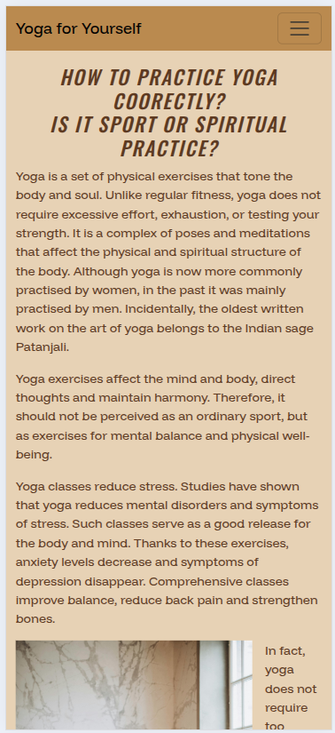  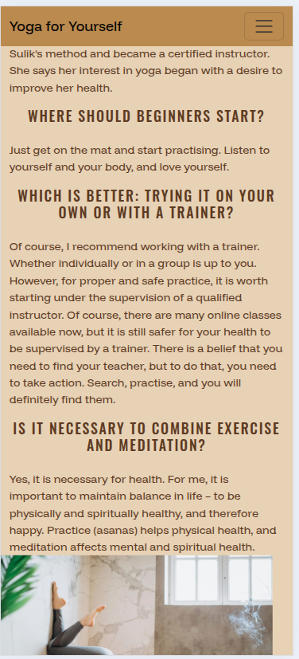 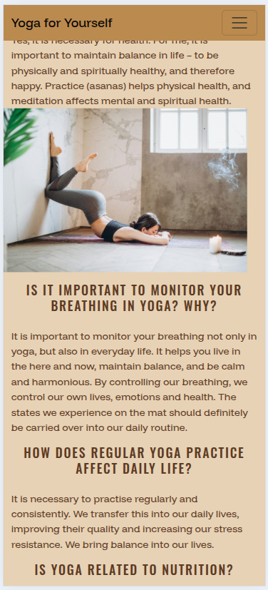 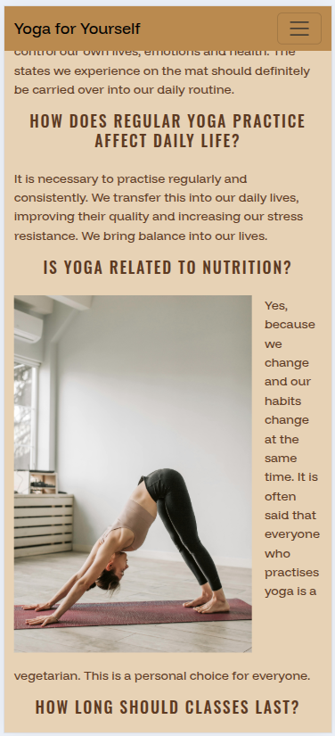 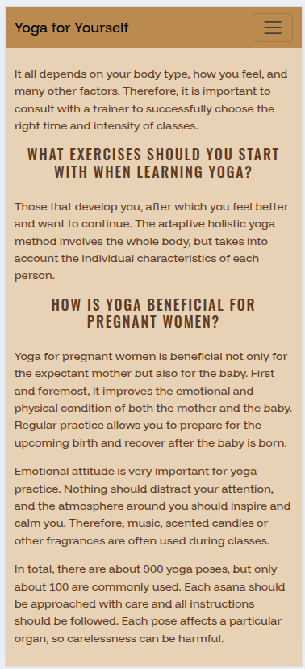 |
| Tablet  |  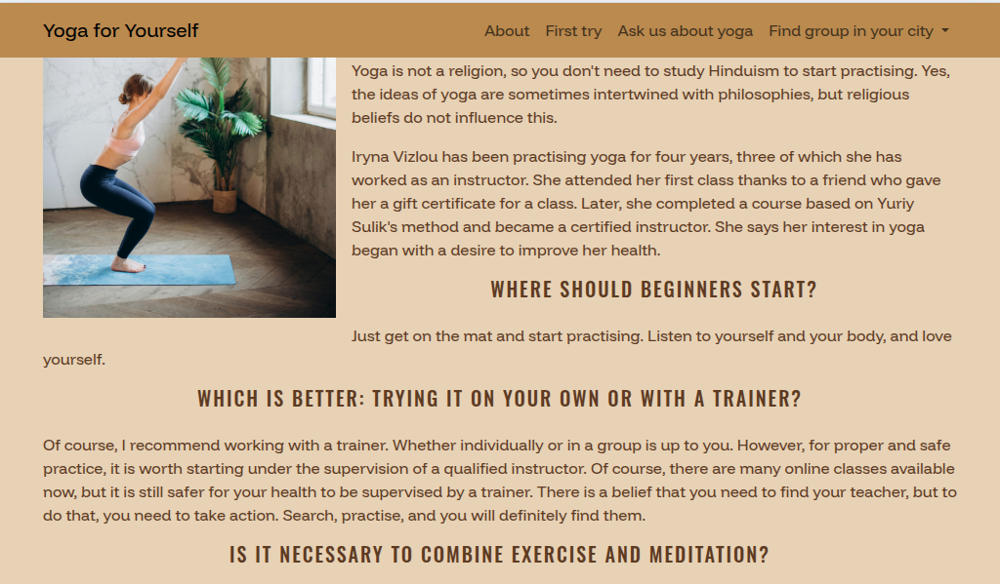 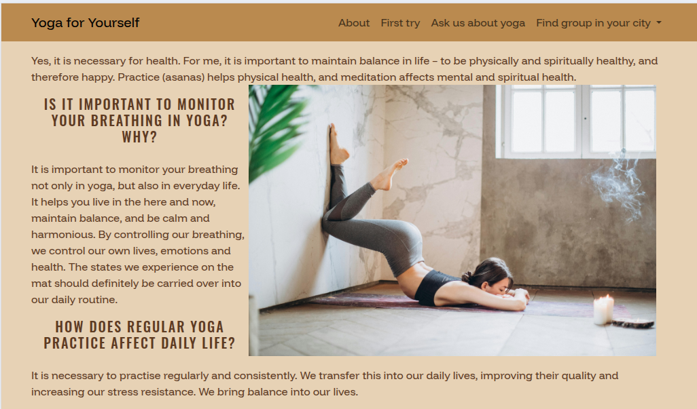 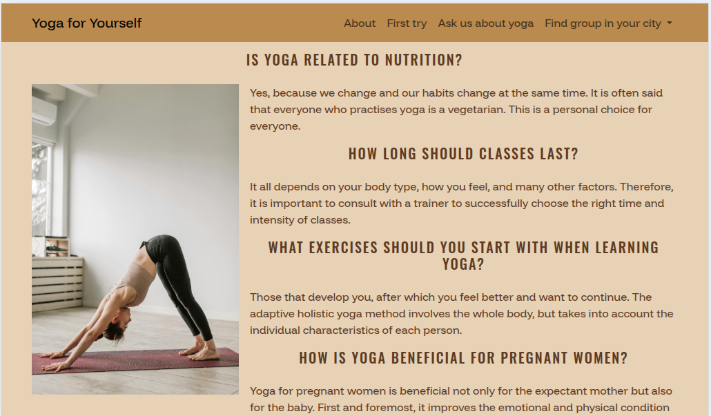 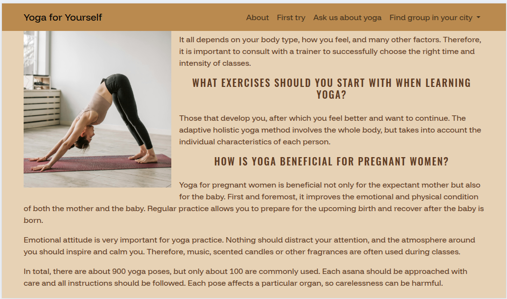                                                                       |
| Desktop | 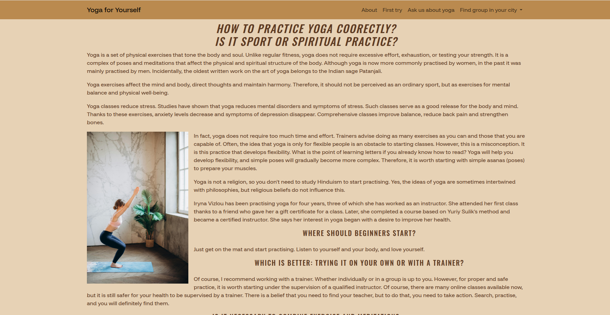 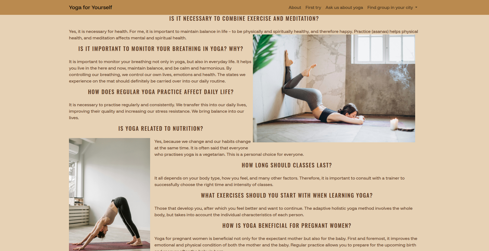 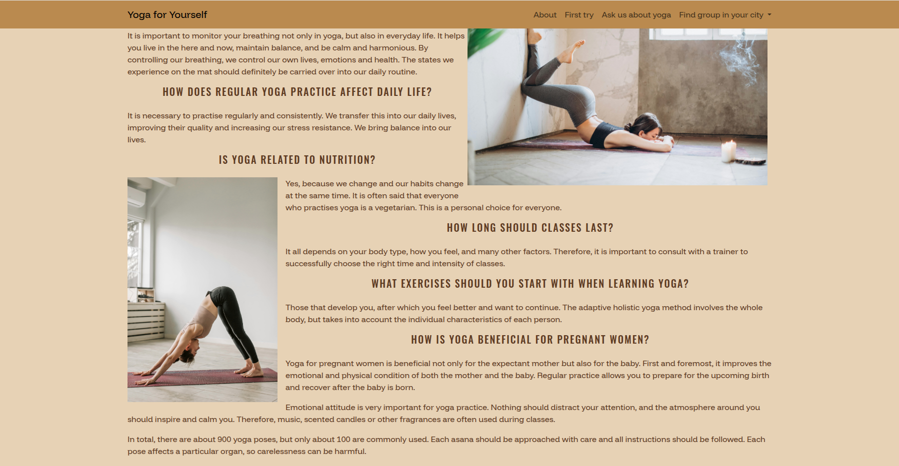                                                                                                                                                                                                                |

### Take Your Inspiration

A collection of beginner-friendly yoga videos from popular YouTube creators.

**Features:**

- Four embedded videos with different durations (10–30 minutes).
- Short descriptions of what each session includes.
- Focus on beginners and accessible practice at home.

**Purpose:**  
Offer users guided practice options that suit their time and needs.

| Device  | Appearance                                                                                                                              |
| ------- | --------------------------------------------------------------------------------------------------------------------------------------- |
| Mobile  |   |
| Tablet  |                                                                      |
| Desktop | 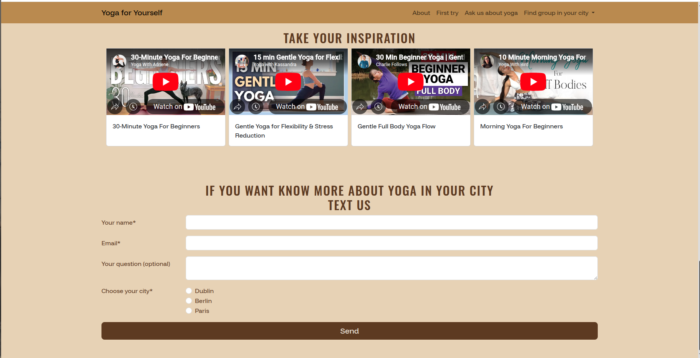                                                                    |

### Contact Us

This section provides a contact form for users who want to learn more about yoga in their city. The form is designed with a responsive layout and includes the following fields:

- Your name – required text input.
- Email – required email input.
- Your question – optional textarea for additional inquiries.
- Choose your city – required selection via radio buttons (Dublin, Berlin, Paris).

The form submits data to a success page (success.html) and is styled with Bootstrap for a clean and mobile-friendly appearance.

| Device  | Appearance                                                           |
| ------- | -------------------------------------------------------------------- |
| Mobile  |    |
| Tablet  |    |
| Desktop |  |

### Footer

This section provides useful external resources for yoga enthusiasts. The footer is designed with a responsive layout and includes the following links:

- [Everything for Practice](https://www.yogashop.nl/) – directs users to a yoga shop offering equipment and supplies.
- [Meditation](https://pmc.ncbi.nlm.nih.gov/articles/PMC10919407/) – links to a research article on meditation benefits.
- [Online Teacher Training](https://asanaathome.com/online-yoga-teacher-training/) – provides access to online yoga teacher training programs.

All links open in a new tab and include proper rel attributes (noopener noreferrer) for security.

### Thank You Page

This page is displayed after a user successfully submits the contact form.
It serves as a confirmation that the message was received and expresses gratitude to the visitor.

**Key features**:

- Responsive design – built with Bootstrap for compatibility across mobile, tablet, and desktop.
- Fixed navigation bar – includes quick links to main sections (About, First try, Ask us about yoga) and a dropdown to find local yoga groups (Dublin, Paris, Berlin).
- Hero section – centered message with a large “Thank you!” heading and a short follow-up text.
- Brand identity – custom favicon, Google Fonts integration (Funnel Display, Oswald, Raleway, Roboto) for consistent typography.

_Purpose_:
To confirm a successful form submission, maintain consistent navigation, and encourage visitors to continue exploring yoga content on the site.
| Device | Appearance |
|---------|------------|
| Mobile |  |
| Tablet | |
| Desktop | 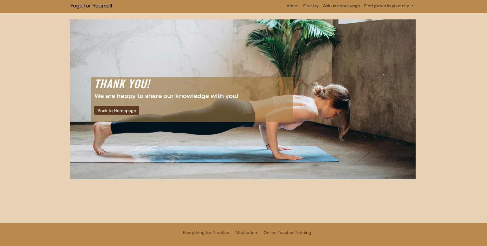 |

### 404 Error Page

This page is displayed when a user navigates to a non-existent URL on the website.
It informs the visitor that the page could not be found and keeps the main site navigation accessible for easy redirection.

**Key features**:

- Responsive design – built with Bootstrap to adapt across all screen sizes.
- Fixed navigation bar – includes links to the main sections (About, First try, Ask us about yoga) and a dropdown menu for city-specific yoga groups (Dublin, Paris, Berlin).
- Hero section – clear and minimal message: “Error 404 – This page does not exist.”
- Consistent branding – same color scheme, typography, and favicon as the rest of the site.

_Purpose_:
To provide a friendly and branded error page that prevents visitors from leaving the site by offering quick navigation back to valid pages.

| Device  | Appearance                                                         |
| ------- | ------------------------------------------------------------------ |
| Mobile  | 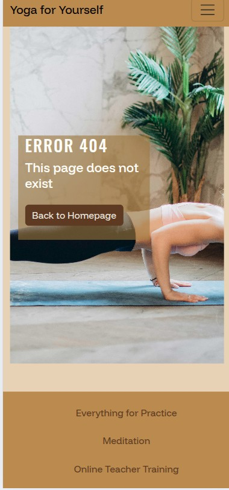  |
| Tablet  | 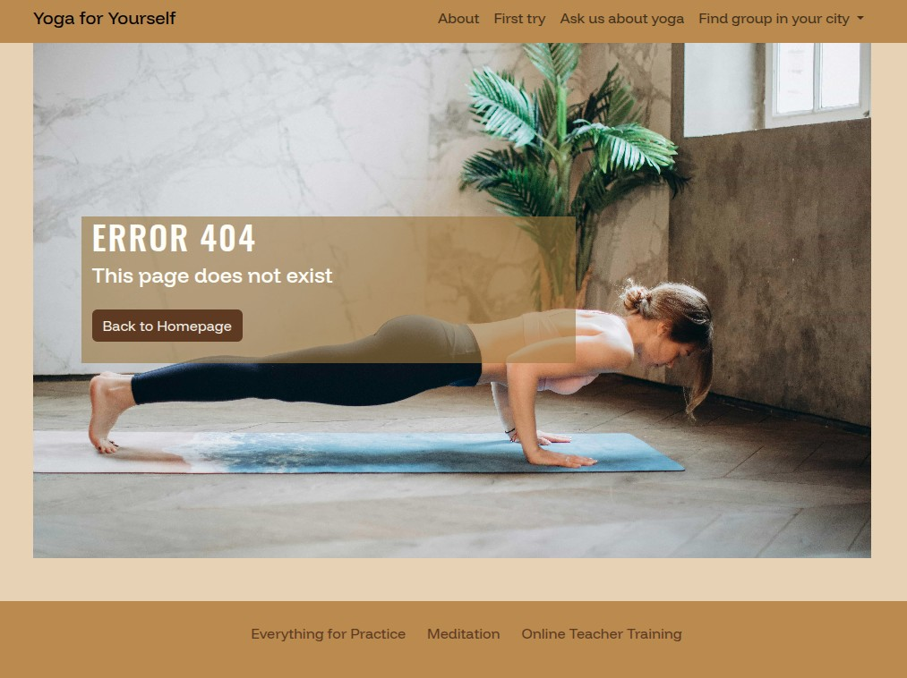  |
| Desktop | 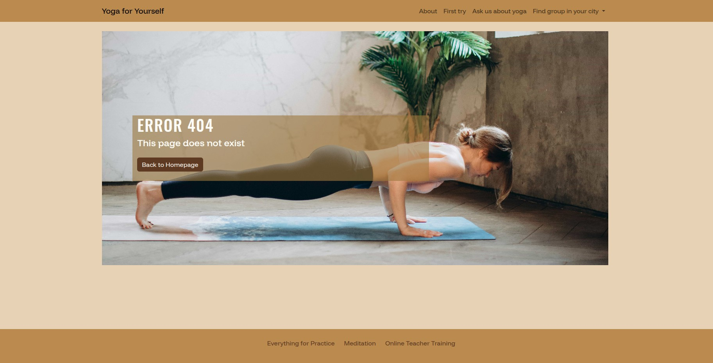 |

### üìç City Pages (Paris, Dublin, Berlin)

Individual city pages showcasing local yoga studios and communities.

**Features:**

- Top 3 yoga clubs in each city.
- Images and descriptions based on **Tripadvisor** listings.
- Embedded Google Maps for location context.

**Purpose:**  
Help newcomers quickly find local yoga communities and places to practice.

Top 3 Yoga Clubs in Dublin (according to Tripadvisor)

| Club Name                                                                                                                                       | Address                                            | Google Maps Link                                      |
| ----------------------------------------------------------------------------------------------------------------------------------------------- | -------------------------------------------------- | ----------------------------------------------------- |
| [Anahata](https://www.tripadvisor.com/Attraction_Review-g186605-d2218126-Reviews-Anahata-Dublin_County_Dublin.html)                             | 11 St Stephen's Green, Dublin 2, D02 FY84, Ireland | [View Map](https://maps.app.goo.gl/kPwrVpm5r5bL1h9r9) |
| [YogaHub](https://www.tripadvisor.com/Attraction_Review-g186605-d7700974-Reviews-YogaHub-Dublin_County_Dublin.html)                             | Co. Dublin, K67 P9C5, Ireland                      | [View Map](https://maps.app.goo.gl/5xjbGmEsAxFKbtMa7) |
| [Live & Breathe Pilates](https://www.tripadvisor.com/Attraction_Review-g186605-d4366798-Reviews-Live_Breathe_Pilates-Dublin_County_Dublin.html) | 20 Camden Row, Portobello, Dublin 8, Ireland       | [View Map](https://maps.app.goo.gl/1nvwMQf6Z6YxkzFh6) |

_Source: [Tripadvisor Dublin](https://www.tripadvisor.com/Attractions-g186605-Activities-c40-t260-Dublin_County_Dublin.html)_

| Device  | Appearance                                                                                                                                         |
| ------- | -------------------------------------------------------------------------------------------------------------------------------------------------- |
| Mobile  | 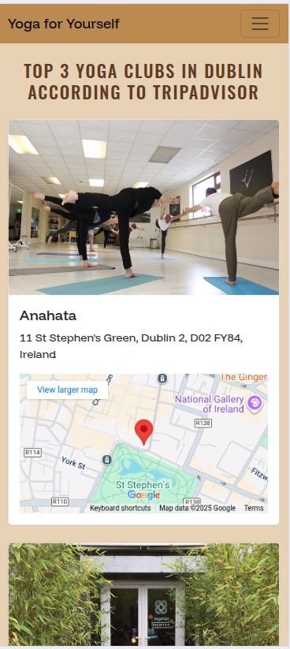       |
| Tablet  | 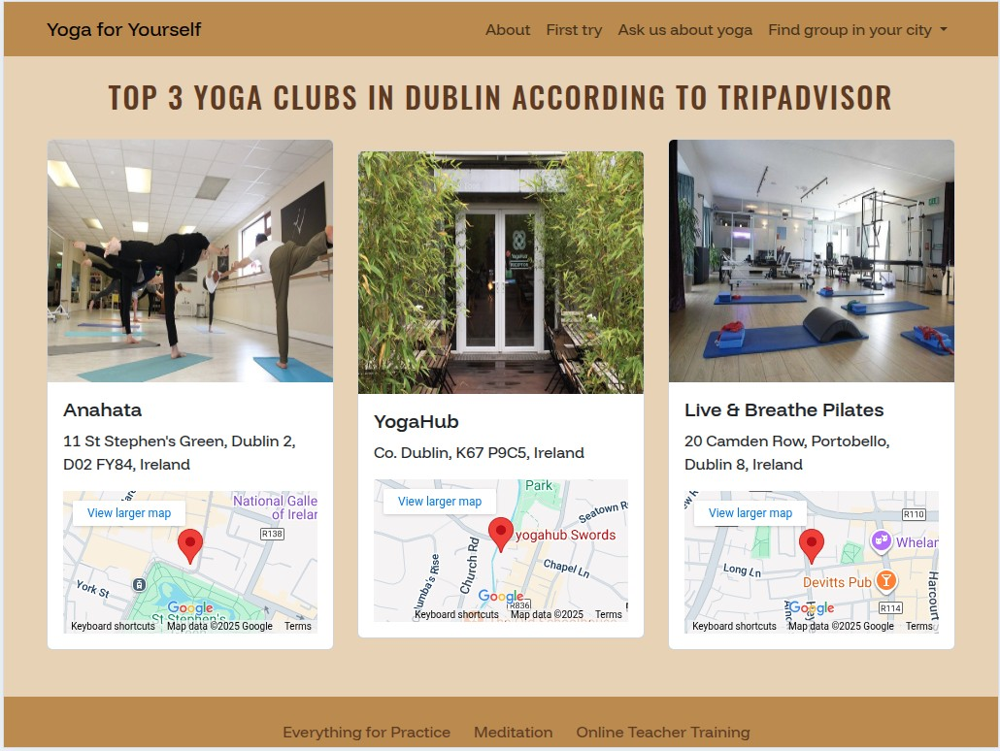 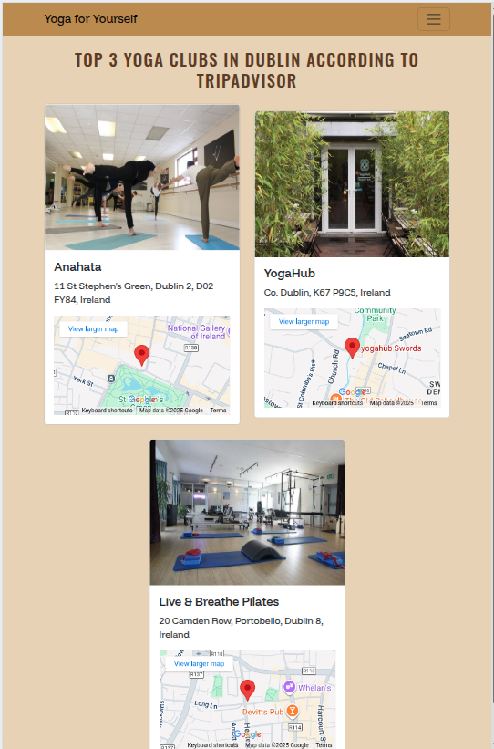 |
| Desktop | 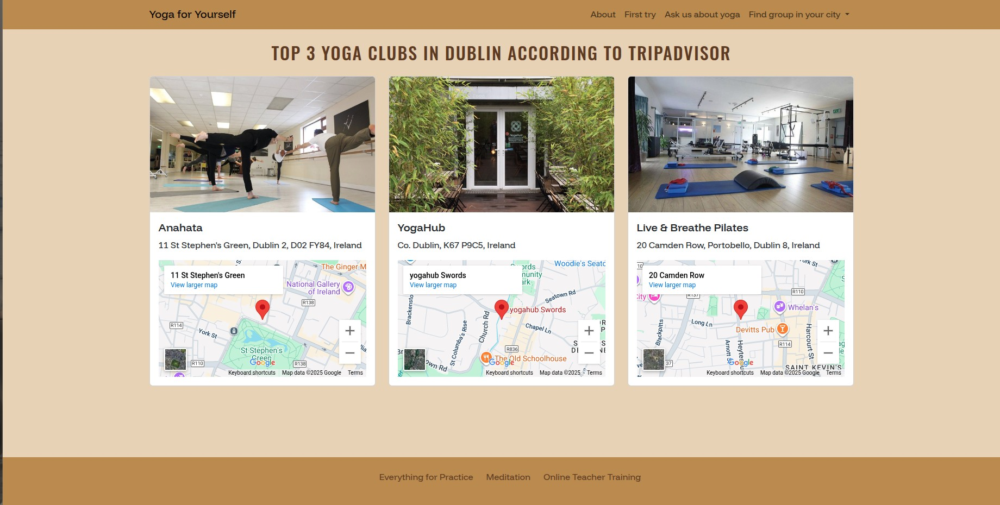                                                                              |

---

Top 3 Yoga Clubs in Paris (according to Tripadvisor)

| Club Name                                                                                                                           | Address                                       | Google Maps Link                                      |
| ----------------------------------------------------------------------------------------------------------------------------------- | --------------------------------------------- | ----------------------------------------------------- |
| [Home Yoga Paris](https://www.tripadvisor.com/Attraction_Review-g187147-d24005738-Reviews-Home_Yoga_Paris-Paris_Ile_de_France.html) | 8 Rue des Acacias, 75017 Paris, France        | [View Map](https://maps.app.goo.gl/PWc1QqrNYGgxTKRKA) |
| [Zen and Sounds](https://www.tripadvisor.com/Attraction_Review-g187147-d16718679-Reviews-Zen_and_Sounds-Paris_Ile_de_France.html)   | 88 Boulevard de Charonne, 75020 Paris, France | [View Map](https://maps.app.goo.gl/1tVnxJm11ErR3uw29) |
| [Spa La Reserve](https://www.tripadvisor.com/Attraction_Review-g187147-d10859306-Reviews-Spa_La_Reserve-Paris_Ile_de_France.html)   | 42 Av. Gabriel, 75008 Paris, France           | [View Map](https://maps.app.goo.gl/ZsYLoHVsakbErbNb7) |

_Source: [Tripadvisor Paris](https://www.tripadvisor.com/Attractions-g187147-Activities-c40-t260-Paris_Ile_de_France.html/)_

| Device  | Appearance                                                                                                                                         |
| ------- | -------------------------------------------------------------------------------------------------------------------------------------------------- |
| Mobile  |  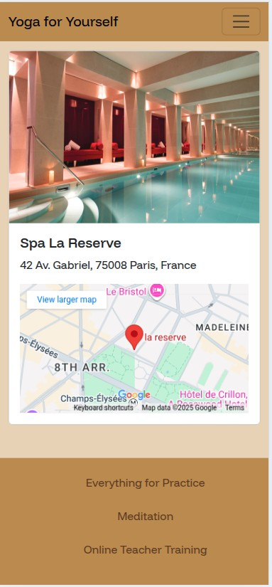        |
| Tablet  | 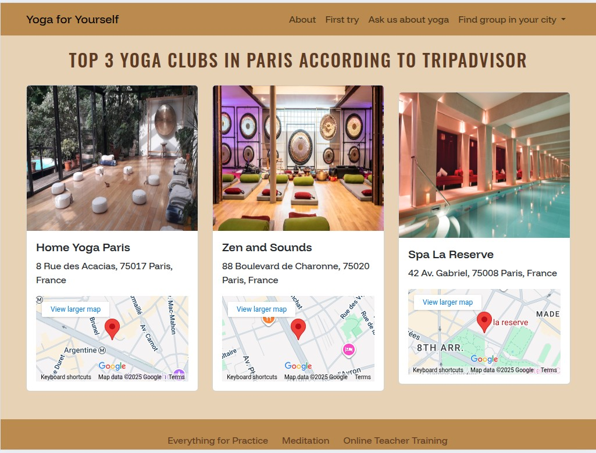 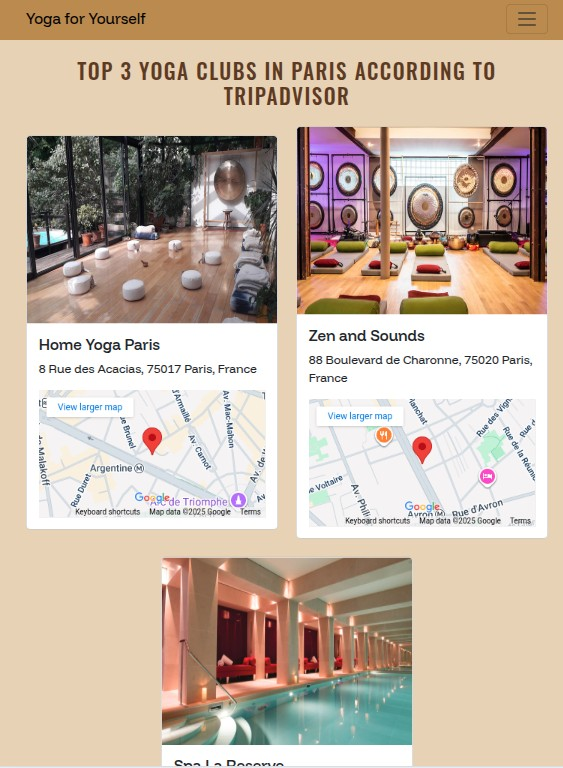 |
| Desktop | 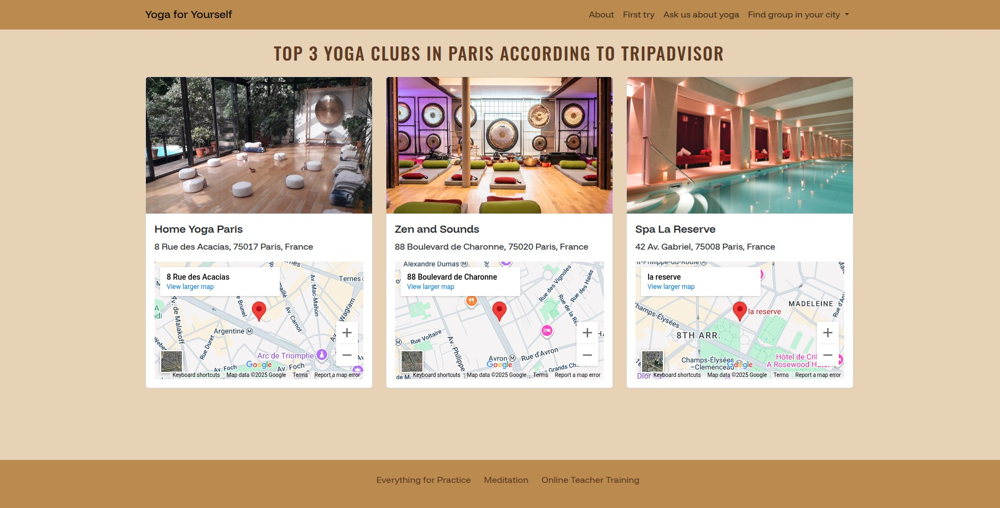                                                                               |

---

Top 3 Yoga Clubs in Berlin (according to Tripadvisor)

| Club Name                                                                                                                      | Address                                       | Google Maps Link                                      |
| ------------------------------------------------------------------------------------------------------------------------------ | --------------------------------------------- | ----------------------------------------------------- |
| [Yoga in English](https://www.tripadvisor.de/Attraction_Review-g187323-d2655792-Reviews-Yoga_in_English-Berlin.html)           | Reichenberger Str. 113A, 10999 Berlin,Germany | [View Map](https://maps.app.goo.gl/F2DrrfQ7Rb1ZYZWG7) |
| [Holistic Yoga Berlin](https://www.tripadvisor.de/Attraction_Review-g187323-d6652130-Reviews-Holistic_Yoga_Berlin-Berlin.html) | Chodowieckistraße 28, 10405 Berlin, Germany   | [View Map](https://maps.app.goo.gl/xNh4NXmvUw1PT9Bv6) |
| [Ashtanga Yoga Room](https://www.tripadvisor.de/Attraction_Review-g187323-d9798721-Reviews-Ashtanga_Yoga_Room-Berlin.html)     | Eitelstraße 85, 10317 Berlin, Germany         | [View Map](https://maps.app.goo.gl/8rkGB6yUeS95Zh5L9) |

_Source: [Tripadvisor Berlin](https://www.tripadvisor.de/Attractions-g187323-Activities-c40-t260-Berlin.html)_

| Device  | Appearance                                                                                                                                         |
| ------- | -------------------------------------------------------------------------------------------------------------------------------------------------- |
| Mobile  | 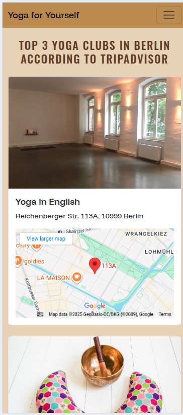 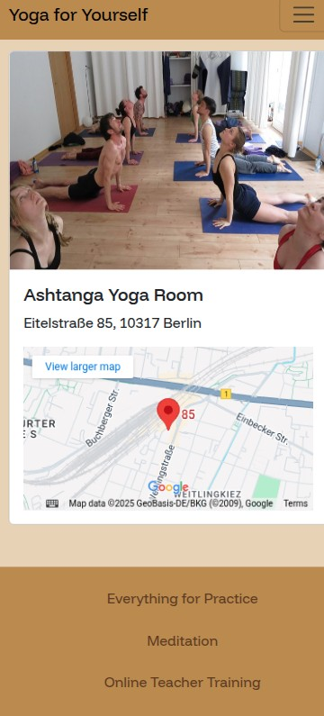      |
| Tablet  | 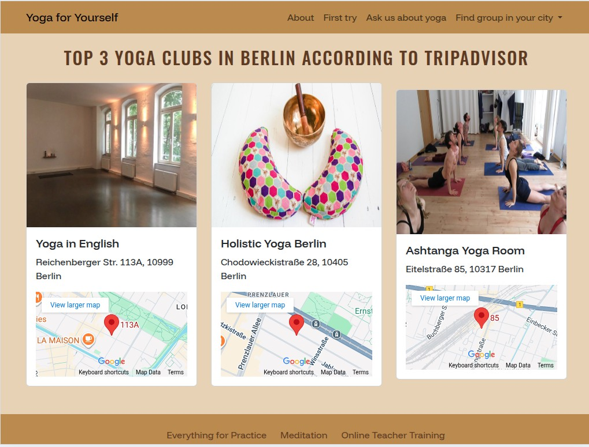 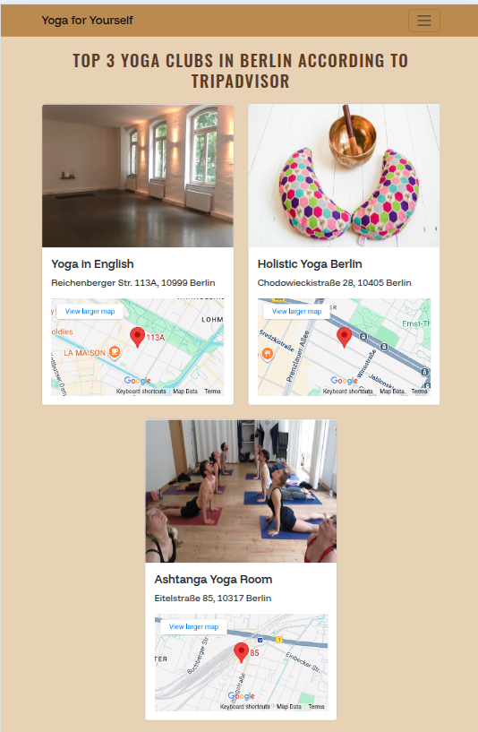 |
| Desktop | 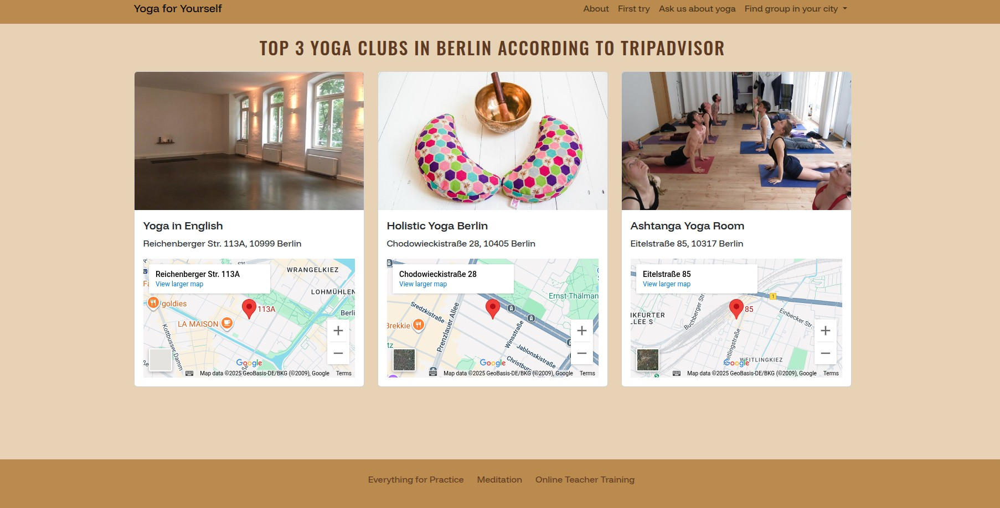                                                                              |

### Credits

- **Favicon & Yoga icon**: [DynosoftLabs](https://www.flaticon.com/authors/dinosoftlabs) from [Flaticon](https://www.flaticon.com/free-icon/yoga_3456459).
- **Background image**: [Elina Fairytale](https://www.pexels.com/@elly-fairytale/) from [Pexels](https://www.pexels.com/photo/3823063/), used under the [Pexels License](https://www.pexels.com/license/).
- **Framework**: [Bootstrap](https://getbootstrap.com/).
- **Article in "About" section**: by [Iryna Vizlou](https://www.vezha.org/sport-chy-duhovna-praktyka-shho-take-joga-i-yak-pravylno-neyu-zajmatys/) (Ukrainian), translated with [Deepl](https://www.deepl.com/en/translator).
- **Images in "About" section** (all by [Elina Fairytale](https://www.pexels.com/@elly-fairytale/), under [Pexels License](https://www.pexels.com/license/)):
  - [Photo 1](https://www.pexels.com/photo/3823075/)
  - [Photo 2](https://www.pexels.com/photo/4534689/)
  - [Photo 3](https://www.pexels.com/photo/3823043/)
- **Videos in "Take your inspiration" section**:
  - [Yoga with Adriene](https://www.youtube.com/watch?v=AB3Y-4a3ZrU)
  - [Yoga with Kassandra](https://www.youtube.com/watch?v=EvMTrP8eRvM)
  - [Charlie Follows](https://www.youtube.com/watch?v=QcsvuCQd53k)
  - [Yoga With Bird](https://www.youtube.com/watch?v=wRAtVLgj-wU)
- **City yoga clubs (Dublin, Paris, Berlin)**: based on **Tripadvisor** data, integrated with **Google Maps** embeds.

### Future Improvements

#### 1. Community / Support

- **User Story:** Find local yoga communities in Dublin.
- **Tasks:** Create section 'community', list groups with links and short descriptions, easy to style.
- **For test:** Users see group info, contacts, links; block is visually separated from studios.

#### 2. Search Functionality

- **User Story:** Quickly search yoga info or studios by city.
- **Tasks:** Add search bar, show results dynamically, allow adding new city pages, maintain styling.
- **For test:** Users search by city, results display existing pages, new pages integrate seamlessly.

#### 3. Success Page

- **User Story:** Show city links and relevant ads after form submission.
- **Tasks:** Add city links, integrate responsive advertiser banners, include “Back to Home” button.
- **For test:** Links and banners are responsive; clicking links navigates correctly; layout stays consistent.

## Code Validation

### HTML

Validated with [W3C Validator](https://validator.w3.org/).

| File         | Link                                                                                                                                  | Screenshot                                    |
| ------------ | ------------------------------------------------------------------------------------------------------------------------------------- | --------------------------------------------- |
| index.html   | [Validate index.html](https://validator.w3.org/nu/?doc=https%3A%2F%2Fkaterynakulik.github.io%2Fyoga%2Findex.html)                     | 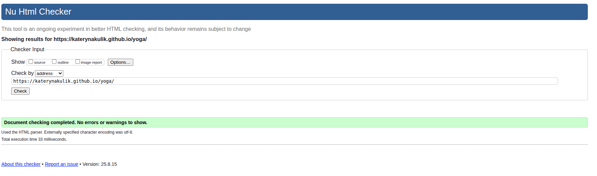   |
| success.html | [Validate success.html](https://validator.w3.org/nu/?doc=https%3A%2F%2Fkaterynakulik.github.io%2Fyoga%2Fsuccess.html)                 | 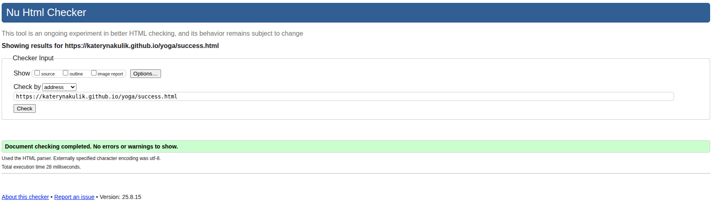 |
| paris.html   | [Validate paris.html](https://validator.w3.org/nu/?doc=https%3A%2F%2Fkaterynakulik.github.io%2Fyoga%2Fassets%2Fcities%2Fparis.html)   | 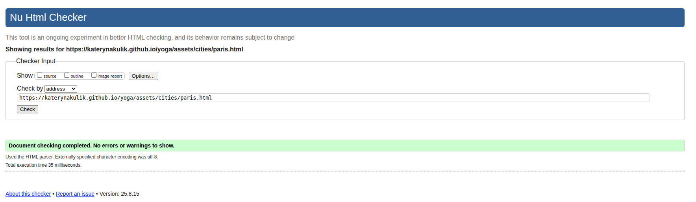   |
| dublin.html  | [Validate dublin.html](https://validator.w3.org/nu/?doc=https%3A%2F%2Fkaterynakulik.github.io%2Fyoga%2Fassets%2Fcities%2Fdublin.html) | 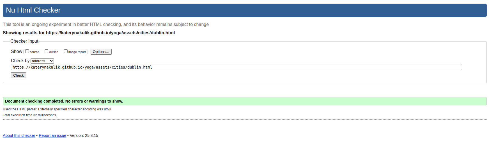  |
| berlin.html  | [Validate berlin.html](https://validator.w3.org/nu/?doc=https%3A%2F%2Fkaterynakulik.github.io%2Fyoga%2Fassets%2Fcities%2Fberlin.html) | 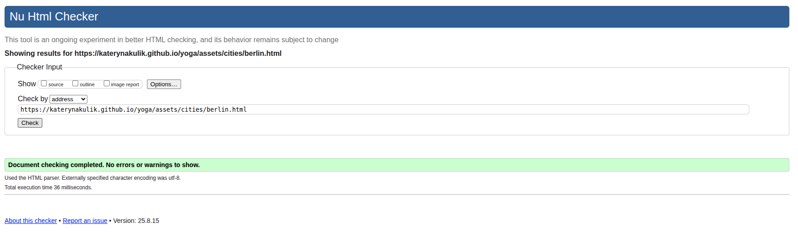  |
| 404.html     | [Validate 404.html](https://validator.w3.org/nu/?doc=https%3A%2F%2Fkaterynakulik.github.io%2Fyoga%2F404.html)                         | 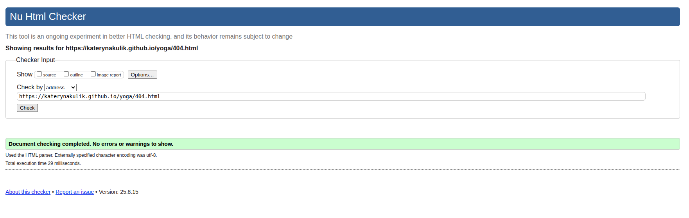     |

### CSS

Validated with [W3C Jigsaw Validator](https://jigsaw.w3.org/css-validator).

[Validate style.css](https://jigsaw.w3.org/css-validator/validator?uri=https%3A%2F%2Fkaterynakulik.github.io%2Fyoga%2Findex.html&profile=css3svg&usermedium=all&warning=1&vextwarning=&lang=en) 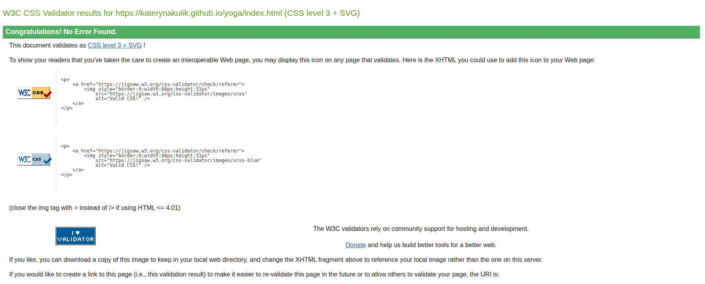

### Lighthouse Audit

Tested using **Lighthouse Audit tool**.

| Page         | Mobile                                                | Desktop                                               |
| ------------ | ----------------------------------------------------- | ----------------------------------------------------- |
| index.html   | 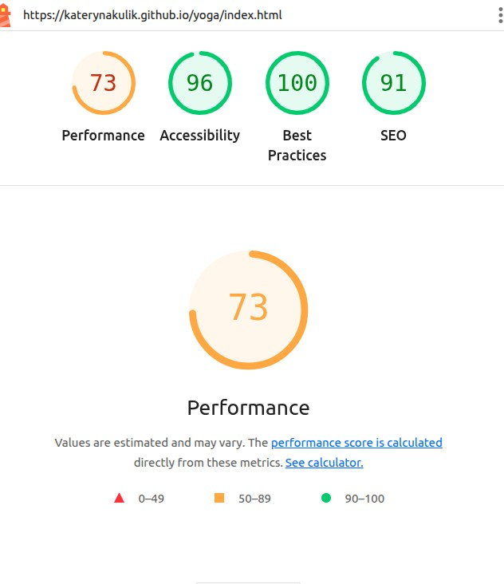   |    |
| paris.html   | 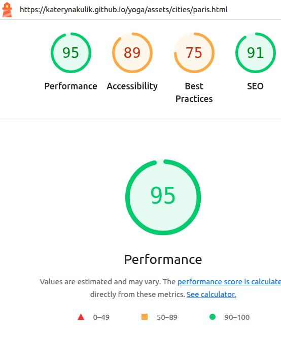   | 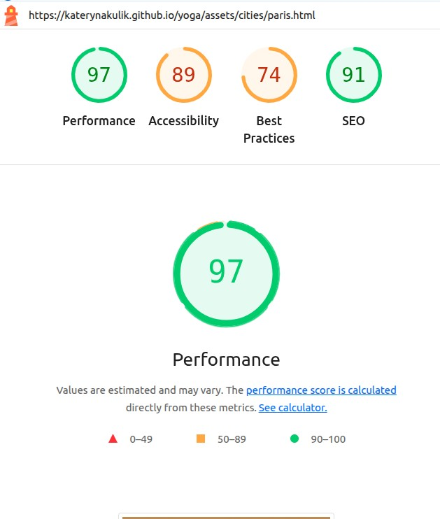   |
| dublin.html  | 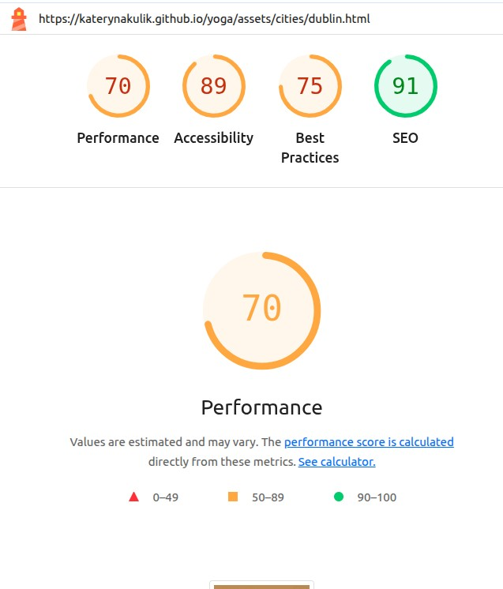  | 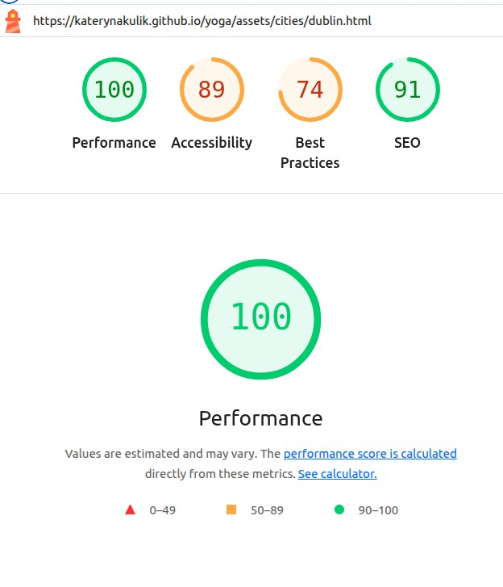  |
| berlin.html  | 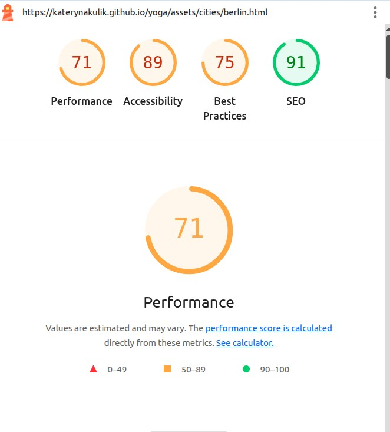  | 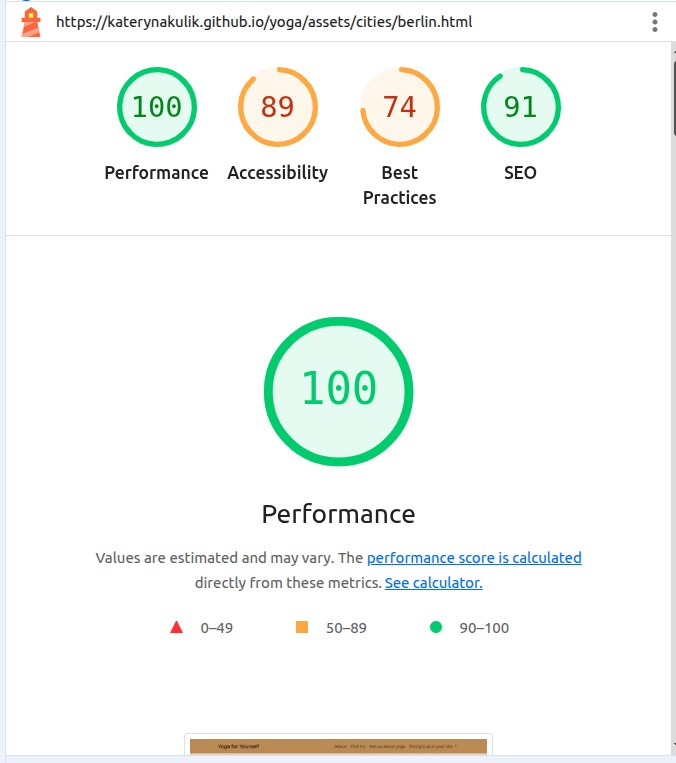  |
| 404.html     |      | 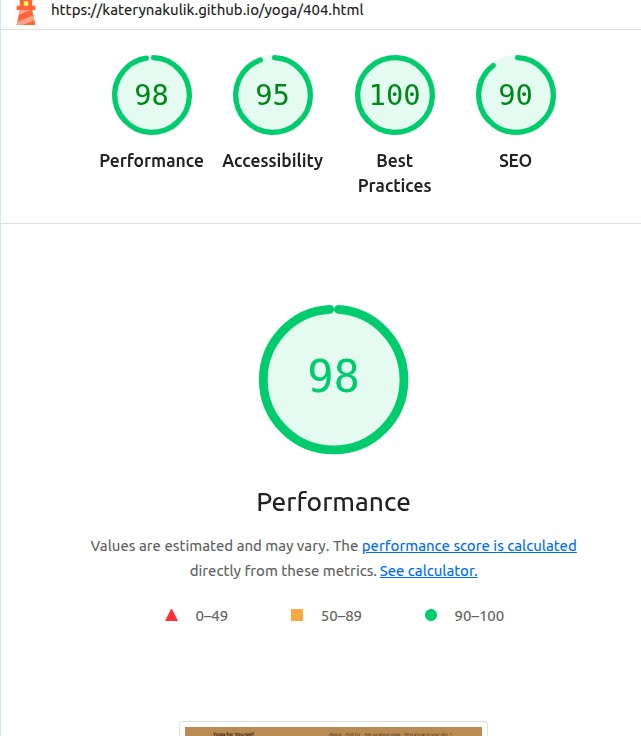     |
| success.html | 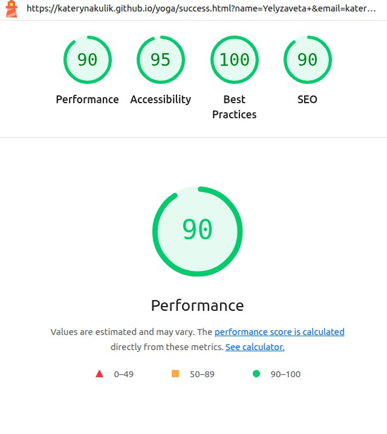 | 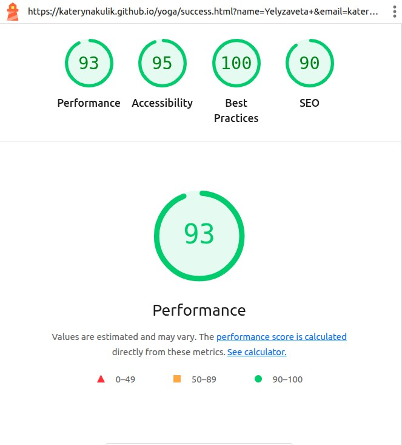 |

### Bugs

- Minor visual inaccuracies may require a designer’s input (e.g., placement of text blocks on images).
- Consider hiding long text blocks under a “Read more” button and revealing them with JavaScript for better readability.
- No critical functional errors were found.

## üöÄ Deployment

### 1. Clone the repository

```bash
git clone https://github.com/Katerynakulik/yoga.git
cd your-repository
```

### 2. Navigate into the project folder

```bash
cd <yoga>
```

### 3. Open the project locally

Open the index.html file in a web browser or use a local development server (for example, Live Server in VS Code).

### 4. Deployment on GitHub Pages

Commit and push latest changes to the main branch:

```bash
git add .
git commit -m "Prepare for deployment"
git push origin main
```

- Go to repository on GitHub.
- Open Settings ‚Üí Pages.
- Under Branch, select main and /root folder.
- Save the settings.
- Site is available at: https://github.com/Katerynakulik/yoga/
